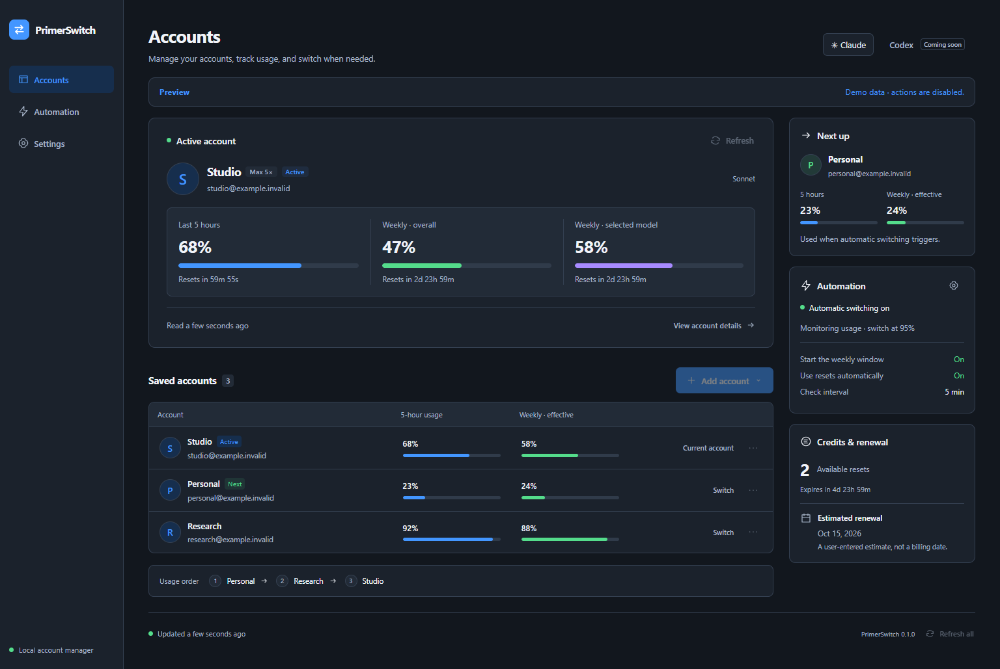

# PrimerSwitch

A Rust desktop account switcher for AI coding assistants. Claude is the first provider; Codex/OpenAI is planned as a separate adapter.

The desktop app uses Tauri 2 and Svelte 5. Authentication, encrypted storage, quota policy, switching and scheduling live in Rust. New installations start in dark mode and English, with Romanian and light/system appearance available in settings.

Download the unsigned [0.1.0 preview](https://github.com/Primer-Tech/PrimerSwitch/releases/tag/v0.1.0-preview.1): [Windows x64 installer](https://github.com/Primer-Tech/PrimerSwitch/releases/download/v0.1.0-preview.1/PrimerSwitch_0.1.0_x64-setup.exe) or [macOS ARM64 disk image](https://github.com/Primer-Tech/PrimerSwitch/releases/download/v0.1.0-preview.1/PrimerSwitch_0.1.0_aarch64.dmg). The release includes dependency notices, SHA256 sums and build provenance.

This is an implementation preview. Windows is the first qualification target. The replacement Mac adapter is implemented, with native qualification still required; the original Swift application remains preserved separately. Linux builds and fixture tests are included in CI, but the production Linux vault is unavailable until its Secret Service backend is qualified. See the [evidence and remaining work](docs/migration/PROGRESS.md).



The screenshot shows the implemented interface with explicitly marked, read-only fixture data. The [design record](docs/design/PROPOSALS.md) preserves the image-model proposals and the approved Direction A.

## Features

- Browser sign-in with PKCE, import of the current Claude CLI login, and previewed legacy account import.
- Manual switching with token-owner verification and encrypted recovery journals.
- Five-hour, weekly and model-specific quota views, reset countdowns, and a ranked consumption order.
- Automatic switching, weekly-window priming, reset-credit handling and notifications.
- Encrypted account vault: DPAPI on Windows and an application-owned Keychain key on macOS.
- Appearance, language, polling, threshold, automation and manual renewal-date preferences.

The adapter follows the original Claude subscription contracts. These include version-sensitive endpoints; fixture coverage is distinct from authenticated compatibility evidence. Priming and active polling send the original tiny Haiku inference request and consume tokens. Existing CLI sessions can retain an earlier login or model setting; switching changes the supported global CLI store.

## Build and run

Install Rust using rustup and Node.js 24, plus the [native Tauri prerequisites](https://v2.tauri.app/start/prerequisites/) for your operating system. The repository pins Rust 1.96.1 and commits Cargo/npm lockfiles. Python 3.11+ is required for preview packaging and repository checks. Use an installed Claude CLI with its default OAuth store; custom credential-store overrides fail closed until qualified.

```sh
npm --prefix apps/desktop ci
npm --prefix apps/desktop run tauri -- dev
```

Build a Windows preview installer with dependency notices:

```sh
python -B scripts/package_preview.py --bundle nsis
```

Run the same command with `--bundle dmg` on a Mac. Packages are unsigned previews. The command records rendered frontend dependencies, checks locked native dependencies and original source hashes, bundles license texts, and writes artifact SHA256 sums. See [packaging attribution](docs/legal/README.md).

The native executable accepts `--demo` for a read-only fixture view that does not inspect real credentials or make provider requests. Closing the application stops its automation. There is no background tray service or launch-on-login requirement in this first version.

## Verify without accounts

```sh
cargo test --workspace --locked
cargo run --locked -p switcher-diagnostics -- --fixtures
npm --prefix apps/desktop run check
npm --prefix apps/desktop test
npm --prefix apps/desktop run build
cargo test --locked -p primerswitch-desktop
cargo clippy --workspace --all-targets --locked -- -D warnings
python scripts/check_repository.py
```

The fixture suite uses temporary homes and fake HTTP transports. It does not authenticate against user accounts, redeem real resets or modify real Claude/Codex files.

## Migration and development

Read the [implementation plan](docs/migration/IMPLEMENTATION_PLAN.md), [Claude behavior contract](docs/migration/BEHAVIOR_SPEC.md), [test inventory](docs/migration/TEST_PLAN.md) and [future Codex plan](docs/migration/FUTURE_CODEX.md). The [shared implementation contract](docs/DEVELOPMENT_CONTRACT.md) and [agent instructions](AGENTS.md) define ownership and safety requirements. [The approved design](docs/design/PROPOSALS.md) was generated with the image model and implemented as a responsive dark dashboard, with a light variant.

The private ClaudeSwitch history, original Swift source and research are kept in a separate checkout and are not part of this repository. A clean public Git history starts with the reviewed Rust implementation. [Repository strategy](docs/migration/REPOSITORY_STRATEGY.md).

MIT licensed. PrimerSwitch is an independent project; provider names identify the tools it integrates with.
