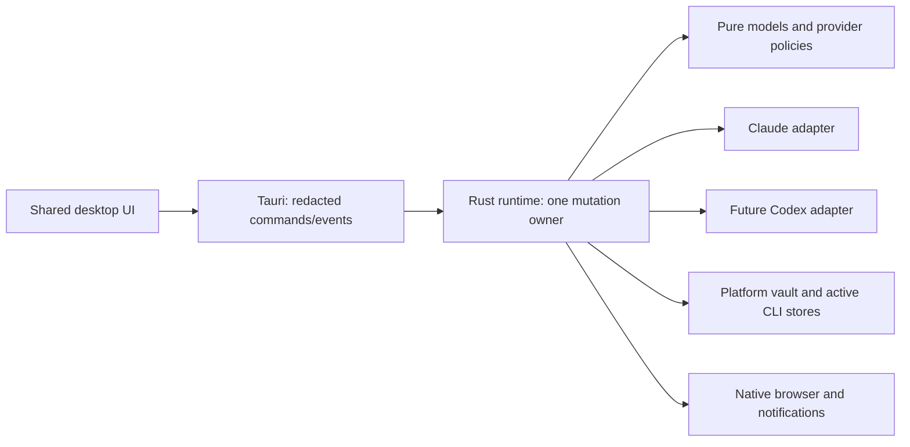

# PrimerSwitch Rust desktop implementation plan

**Implementation authorized; this document is the migration design baseline.** Prepared on 2026-10-02 from upstream commit `4b1b441084fccf5f717fcf41d1b5e668f18559a0`, source inspection, public CLI installation metadata, and primary documentation. Read [progress](PROGRESS.md) for completed work and unresolved checks, [behavior](BEHAVIOR_SPEC.md) for exact Claude rules, and [tests](TEST_PLAN.md) for acceptance evidence.

## 1. Outcome and boundaries

Build a Windows desktop application with the original Claude account management, browser login, manual switching, model-aware usage display, automatic switching, weekly priming, banked reset handling, preferences and notifications. Preserve macOS throughout the migration and qualify a replacement there before retiring the Swift app. Design the same core for Linux; native Linux validation follows Windows/macOS.

The user confirmed **PrimerSwitch** and authorized the separate `Primer-Tech/PrimerSwitch` open-source repository, which has now been created. Keep the private ClaudeSwitch baseline/history separate. [REPOSITORY_STRATEGY.md](REPOSITORY_STRATEGY.md) defines the reviewed publication boundary. Current publication and validation state is recorded in PROGRESS.md. The later UI instruction requires English by default, Romanian support, and image-model design proposals shown for selection before redesign.

The user's Rust preference is the architecture constraint. Use a Rust workspace with Tauri 2 and a thin Svelte/TypeScript interface. OAuth, tokens, provider integration, policy, persistence and scheduling live in Rust. The UI choice means the backend is Rust and the renderer is web technology; this is not an all-Rust UI. Iced/Slint could avoid a web renderer, but would require different UI/native-integration work. The default recommendation is Tauri for a shared desktop interface and platform packaging; record a change before switching frameworks.

Future Codex/OpenAI accounts belong in the same product, through a distinct provider adapter described in [FUTURE_CODEX.md](FUTURE_CODEX.md). Claude parity is the first delivery gate. Do not implement two duplicated applications, force OpenAI authentication into Claude's token schema, or switch between providers automatically when one exhausts its quota.

The user authorized implementation and public repository creation after completing this planning phase. Implementation is now authorized; progress and evidence are recorded in PROGRESS.md.

## 2. Baseline preservation and rollout

The original 19 upstream files are retained with exact canonical Git blob bytes in the separate private ClaudeSwitch checkout's archive. Its private preservation manifest records paths, SHA-256, byte lengths and Git object IDs, with a verifier against the upstream Git objects. Its old build script and source-relative package layout remain intact. Compilation after relocation remains a macOS check, not a verified result on this Windows machine. The public repository neither contains nor depends on that archive/history.

Keep the archived files unchanged in the private baseline. New Rust/UI code lives in the separate reviewed public tree. Keep the legacy `com.claudeswitch.app` bundle/preferences and old account directory separate from the replacement's app ID `com.primertech.primerswitch`, settings and encrypted store. Public validation does not depend on private upstream Git objects.

Rollout sequence:

1. Implement and verify against fixtures; retain the old app as the macOS path.
2. Qualify Windows manual switching, then complete the full Claude feature matrix, including automation and reset edge cases.
3. Qualify new macOS storage, migration and runtime behavior; switch macOS users only after native checks pass.
4. Build Linux early enough to catch portability mistakes, then qualify a documented desktop/storage environment separately.
5. Add Codex/OpenAI behind a provider capability gate after Claude delivery.

Do not run legacy and replacement automation together; both write the active CLI credentials. Rollback preserves old data, but copied OAuth refresh tokens can become obsolete after rotation. Relogin may be needed; retaining old source cannot guarantee old token snapshots remain usable.

## 3. Proposed workspace and dependency direction

The workspace below is implemented except the future provider and shared fixture directory; exact completion evidence is in the ledger:

```text
Cargo.toml                         # workspace, shared dependency versions
rust-toolchain.toml                # pinned supported toolchain
crates/
  switcher-core/                   # identities, redacted views, pure Claude policy
  switcher-platform/               # OS paths, vault protection, CLI active stores
  switcher-runtime/                # actor, repository, scheduler, transactions
  provider-claude/                 # OAuth/profile/usage/reset HTTP contracts
  switcher-diagnostics/            # hermetic probes; no desktop dependency
  provider-codex/                  # FUTURE: versioned local Codex protocol adapter
apps/desktop/
  src/                            # Svelte + TypeScript; Romanian strings and UI
  src-tauri/                      # IPC bridge, native windows/notifications
tests/fixtures/                   # sanitized legacy/HTTP/header/crash fixtures
scripts/                          # preservation and packaging checks
docs/migration/                   # these documents and task/evidence ledger
# Swift baseline is retained in a separate private checkout
```

Dependency rules:

- `switcher-core` has no Tauri, network, keychain, filesystem or system-clock dependency. It consumes typed observations and injected time.
- Provider crates depend on core contracts and implement their own authentication, quota parsing and capabilities. They do not own windows or scheduling.
- `switcher-platform` implements vault and active-store abstractions. It must not choose an account or send an inference request.
- `switcher-runtime` composes core, provider and platform components, and owns mutations. Diagnostics compose the same services with fixture dependencies.
- Tauri translates approved commands/events into redacted Rust types. Svelte renders state and intent; it never decides which token to refresh or which reset to spend.



Pin supported versions at M00, commit Cargo/npm lockfiles when implementation starts, and choose compatible maintained APIs from current documentation. Do not freeze the plan to an untested patch version. Suggested building blocks: Tokio, Serde/serde_json, reqwest with rustls, cryptographic randomness/PKCE hashing, zeroize/secret wrappers, a reviewed AEAD library, UUIDs, tracing with a redaction policy, OS-specific security bindings, and file locking. Record dependency/backend choices and supported toolchain in the ledger.

## 4. Provider model designed for Codex later

Use an internal `ProviderId` and `AccountKey` composed from provider + stable provider account/workspace identity. A display email/name is not a unique ID or path. For Claude, include the account UUID and organization when selecting among organization credentials; unknown identity is a separate unverified state. Migration must avoid duplicating accounts when an organization field becomes known later.

Use provider-tagged credential payloads behind an opaque vault reference. Do not define one common `{accessToken, refreshToken, expiresAt}` struct and require every provider to use it. Providers may use managed OAuth caches, API keys, organization/workspace constraints or host-owned tokens. The UI receives only auth kind, display identity and supported actions.

Shared quota views contain dynamic window IDs/labels, unit, utilization if known, reset time, scope/model, observation source and timestamp, and optional duration/credits. Preserve unknown fields in provider payloads. Claude's two rings are a Claude presentation; Codex's primary/secondary and limit IDs must not be renamed five-hour/seven-day by assumption.

Compile a small provider registry into the application. Capabilities cover login/import, active-store switching, isolated launch, usage, automatic policy, priming and reset redemption. Unsupported actions are absent/disabled with an explanation. No dynamic executable plugins or arbitrary OAuth endpoints are needed for v1.

Maintain active state, auto-switch settings, cooldowns, pending operations and decisions **per provider and active CLI context**. A `CliContext` identifies resolved home/config/store overrides and CLI version; cached snapshots from another context must not be reused for writes. One unified UI can later show provider tabs and a combined overview while retaining separate policies and histories.

## 5. Platform and CLI compatibility adapters

### Windows first

Initial native target: Windows 11 x64 on this machine. Confirm the support matrix at M00; Windows ARM64/other OS versions are additional evidence, not inferred from Rust portability. Use the MSVC toolchain and WebView2 required by [Tauri prerequisites](https://v2.tauri.app/start/prerequisites/).

Windows Claude's default credential source is `%USERPROFILE%\.claude\.credentials.json`; default identity is `%USERPROFILE%\.claude.json`. Resolve the actual home and CLI overrides through one adapter, independent of Tauri's app-data directory. Keep Windows drive/UNC paths, Unicode, spaces, case handling, reparse points and shared-file replacement in filesystem tests. Never pass credentials to PowerShell or `security`-style subprocess arguments.

Implement same-volume private temporary files and an atomic replace/create primitive with explicit Windows semantics, not Unix `rename` assumptions. Recheck permissions after replacing. Handle a CLI/editor holding files open by returning a retryable conflict without deleting the destination. There is no transaction spanning credentials JSON and global configuration: the encrypted journal below supplies recovery.

### macOS from the start

Use native Security framework APIs for the active Claude Keychain item, preserving/update-testing its accessibility/access-control behavior. Verify service/account selectors using the supported installed CLI, a dedicated test user/item and the previous app's behavior. Avoid plaintext tokens in `security -w` child arguments. Native [password APIs](https://docs.rs/security-framework/latest/security_framework/passwords/index.html) exist, but an API's existence does not prove the CLI's item selector or ACL behavior.

Retain macOS 14 as the initial replacement minimum to match the legacy baseline. Test both Apple Silicon and Intel before claiming both. Follow Claude's actual secure-store fallback when Keychain is unavailable; do not automatically create a different item because a lookup failed. Import preferences through CFPreferences for the old app domain, not by assuming every preference has already been flushed to a plist file.

### Linux portability and later qualification

Claude normally uses the credentials file. Use XDG app-data/config locations for the replacement's own files, GTK/WebKitGTK dependencies for Tauri, and a qualified Secret Service environment for saved credentials. A missing or locked secret service is a visible vault-unavailable state; do not silently downgrade to plaintext. Choose a supported desktop/distro and verify permissions, Wayland/X11, notification service and secret-store availability before declaring Linux usable.

Linux tray click events differ from Windows/macOS; a tray is optional here and cannot be the sole navigation path. [Tauri tray behavior](https://v2.tauri.app/learn/system-tray/).

### Known compatibility questions to close in M00/M07

Official [Claude authentication documentation](https://code.claude.com/docs/en/authentication) describes Windows/Linux file storage, macOS Keychain/file fallback and `CLAUDE_CONFIG_DIR`. Read-only static inspection of the installed Windows Claude 2.1.287 executable additionally found:

- Default config directory from `CLAUDE_CONFIG_DIR`, otherwise `~/.claude`, normalized NFC.
- Credential path formed from a secure-storage directory and `.credentials.json`.
- `CLAUDE_SECURESTORAGE_CONFIG_DIR` **unset** falls through to the config directory; explicitly empty selects the default `.claude` directory. Empty and unset are different.
- Embedded Keychain selector code includes a config-path hash and account label `claude-code-user`; this is not proof of the item used by a newer macOS executable. The legacy uses `NSUserName()`.

The custom global identity/config path under all override combinations was not fully traced. Build an isolated compatibility harness and obtain the effective path from public CLI source/version evidence or fixture-environment behavior before writing any custom-context data. Do not guess that every override places `.claude.json` in the same directory.

Detect native npm and standalone installations without relying on `cli.js`; the installed npm package points to `bin/claude.exe`. Environment authentication such as `ANTHROPIC_API_KEY`, alternate provider modes and managed settings can supersede a subscription login. Report that a switch might not affect the effective session and preserve the user's configuration. Inspect names/effective modes, never log secret environment values. [Claude environment variables](https://code.claude.com/docs/en/env-vars).

## 6. Storage, migration and credential ownership

### Replacement vault

Separate the encrypted saved-account collection from the CLI's active credential store. The latter must remain in the format the CLI expects, even when that format is plaintext. Recommended saved-store design:

- Versioned metadata/config in the replacement's platform app-data directory; credential-bearing records and journals are encrypted, with filenames based on opaque IDs.
- AEAD envelopes bind schema/provider/account/key version as associated data, with a fresh nonce per write. Authenticated encryption failures preserve the original file and present a recoverable error.
- An OS-protected master key: DPAPI CurrentUser on Windows; a separate application-owned Keychain item on macOS; Secret Service on Linux. Limit Windows filesystem ACLs to the current user/system as appropriate and use `0700`/`0600` on Unix. [DPAPI documentation](https://learn.microsoft.com/en-us/windows/win32/api/dpapi/nf-dpapi-cryptprotectdata).
- A lost/locked key never triggers silent generation of a new key over an existing vault. Handle unlock/key loss explicitly, retaining files. Portable export requires a separately designed password-encrypted format and is future scope.

Decide native store crate integration at M00. Current `keyring` APIs have changed; application-specific backends may use `keyring-core` plus explicit credential stores. Do not copy old feature flags or claim Linux support merely because a crate compiled. [Current keyring documentation](https://docs.rs/keyring/latest/keyring/).

Saved account schema preserves recognized legacy fields and opaque provider extensions, with versioned migrations and idempotency. Cache observations have source/freshness, not just a global `lastUsageAt`. Discarding a malformed optional reset section may retain valid usage; damaging credentials never causes an apparently empty new vault.

### Legacy import

Provide a preview/import action for `~/Library/Application Support/ClaudeSwitch/accounts` on Mac, and a user-selected copied legacy directory on another OS. Do not scan arbitrary user profiles or auto-upload files. Preview reports valid/invalid records and duplicates with no credentials displayed. Import into the new vault, preserving renewal, cooldowns, priming markers, cache timestamps and pending claims. Validate timestamps/IDs and show quarantined problems rather than destroying the source.

Merge by provider identity, choose newer proven credential state, and keep a durable migration record per source hash/schema. A resumed import must not overwrite a token already rotated in the new vault or duplicate a pending reset. Import the five automation/poll/threshold preferences plus appearance through an explicit mapping of B02 keys. Keep the old directory and settings untouched. Rerunning import is safe and reviewable.

### Refresh ownership

Claude active refresh belongs to the CLI; the switcher adopts proven live tokens and refreshes only inactive saved accounts. Serialize all refreshes for one identity and persist rotation before reading usage or switching. A network completion for a deleted/stale UI entry cannot recreate it automatically; preserving a rotated token must follow a deliberate repository-generation rule.

For future Codex managed OAuth, prefer the official local app-server's ownership of login/refresh. Do not reuse Claude's refresh implementation or independently rotate a copied active Codex token. See the future provider plan for shared-cache and keyring constraints.

## 7. Recoverable switching transaction

Use a single app instance, runtime mutation owner and per-context filesystem lock. Other tools/the CLI do not honor our lock, so use compare-before-write/readback checks as well; ordinary file stores cannot provide a universal CAS transaction against external processes.

Transaction procedure:

1. Resolve CLI context and target identity. Read and parse active identity plus credential-store fingerprint; reject corrupt originals instead of replacing them with `{}`. Keep unrelated config/credential fields.
2. Capture outgoing credentials, verify their account owner when ambiguous, and persist them to the correct saved account. If verification is unavailable, suspend the write rather than overwrite another account's saved credentials.
3. If target is inactive, refresh/validate it as needed and durably persist rotation. Recheck context/outgoing fingerprints after awaited work.
4. Write an encrypted, flushed journal containing original/desired fingerprints, protected snapshots, target/account IDs and transaction stage. Create a protected first backup without overwriting an existing valid backup.
5. Apply target auth payload through the active-store adapter. For a credential JSON file, patch `claudeAiOauth` while preserving unrelated root fields; carry target auth extensions. Apply target `oauthAccount` to the parsed global config with atomic single-file replacement.
6. Read back both stores and verify the resulting owner/config. Mark committed and persist target metadata before disposing of journal snapshots under the defined retention rule.
7. On failure or startup with an incomplete journal, inspect both stores. Roll back only components still equal to this transaction's writes; never overwrite a newer external login. If one component changed externally or state is ambiguous, stop automation and show a repair/relogin action with a redacted diagnosis.

Define stages (`prepared`, `auth_written`, `identity_written`, `verified`, `committed`) and fault-inject before/after each durable write. Do not describe multi-file/Keychain writes as globally atomic. Closing the window, an exception, or process termination must leave enough journal state for the next launch to reconcile. If the CLI changes an outgoing token during a transaction, report/retry from a fresh snapshot rather than winning a destructive last-writer race.

## 8. Runtime, networking and decision quality

Use a Tokio task owning runtime state, receiving commands via channels. Work is keyed by stable account ID/provider/context and an operation/revision generation. Coalesce periodic and manual refresh requests. Keep HTTP/filesystem work outside long-held mutexes; feed tagged results back to the owner. One operation requiring a credential mutation per account at a time. Switching/reset execution is serialized against context changes; cancellation is checked between side effects, never halfway through an unjournaled write.

Inject clock, HTTP transport, account repository, active credential adapter, notifications and browser launcher. Use monotonic timers for in-process scheduling, persisted epoch timestamps for restart cooldowns, and bounded treatment of future/skewed wall-clock timestamps. After suspend/resume, schedule one recomputation, not a backlog of every missed tick. Countdown rendering does not make HTTP calls.

Preserve B02 cadence and B13 ordering. Implement D06/D07 with distinct metadata attempt/success timestamps and cooldown state; a successful inference must not clear metadata throttling. Fast ticks make no usage-metadata enrichment/fallback call. If an automatic switch/reset needs metadata preflight, coalesce that intent into ordinary scheduled work governed by the same endpoint cadence/cooldown; do not call the endpoint on every fast tick. Manual refresh respects provider cooldowns and cannot become a burst bypass.

Proposed freshness contract, to encode explicitly in M01/M05 tests:

- Automated Claude decisions need an identity-verified active reading produced in the current decision cycle. A failed fresh read suspends mutation even if an old ring is still displayed.
- Cached inactive usage can populate the plan for 900 seconds. Before selecting it for an automatic switch, obtain/validate a decision reading no older than 120 seconds; if cooldown/identity failure prevents that, suspend that choice and consider only other qualified candidates.
- Scoped rows carry their own metadata timestamp. Known relevant rows older than 1,800 seconds cannot trigger or justify a switch; refresh or suspend the model-aware decision. Fresh metadata with no scoped row is a valid account-wide-only observation.
- Reset status may inform the display/offer plan, but validate eligibility, selected grant and all blocking windows with observations no older than 120 seconds before a new redemption. Respect throttling; do not spend a grant because stale status looked usable.
- A pending reset is a reconciliation operation, not a new claim. Retain/retry its idempotency key according to the provider contract even when an offer disappears. If older than 24 hours, reconcile status/result; do not mint a replacement key for an unresolved outcome. An unknown result stays visible and disables further redemption on that account until resolved.

These deliberately tighten stale-data behavior. If native evidence shows the metadata budget cannot support a chosen preflight cadence, adjust freshness policy with measured evidence and explicit documentation, rather than silently omitting the check or polling at 30 seconds.

Use shared reqwest/rustls clients with source timeout values, bounded response sizes and typed status handling. Respect numeric and HTTP-date `Retry-After` values where supported. Use OS/user proxy and trusted CA settings through documented configuration; do not disable certificate validation. Confine authenticated requests to provider allowlisted origins and prevent credential-bearing redirect leaks. Redact errors before logging/IPC; do not display raw authenticated response snippets.

Reset attempts, token rotation and priming markers are durable before their side effect. Reset replay can be idempotent using the request key; tiny priming inference has no proven idempotency mechanism. Represent an uncertain priming outcome explicitly and reconcile without promising exactly-once delivery.

## 9. Desktop shell and IPC

The Rust-to-UI snapshot includes revision, provider capability summary, redacted accounts, active/default-model state, dynamic quota windows, freshness, pending actions, settings, typed errors, reset/renewal labels and consumption plan. No secret fields, arbitrary JSON credential blobs or paths chosen by JavaScript are returned.

Proposed typed commands:

| Command family | Intent |
| --- | --- |
| `get_snapshot`, subscribe to `snapshot_changed` | Display/reconcile by revision; snapshot read does not trigger network work |
| `begin_login`, `finish_login`, `cancel_login` | Provider + backend login ID; pasted code is transient input |
| `import_current`, `switch_account`, `refresh_account` | Provider/context + stable account ID; backend preconditions govern mutation |
| `delete_saved_account`, `set_renewal_day` | Confirmed record removal and validated optional 1–31 day |
| `patch_settings` | Validated provider-scoped settings and shared appearance |
| `preview_legacy_import`, `apply_legacy_import` | Native-selected directory/preview token; no arbitrary frontend file IO |
| `get_diagnostics` | Redacted version/capability/storage state; never credential content |

Define an allowlist of Tauri commands/capabilities and restrict navigation to bundled content. Browser authorization opens externally via an approved URL builder; no remote authenticated pages inside the privileged WebView. Do not implement a frontend HTTP proxy or expose general shell/file capabilities. [Tauri IPC](https://v2.tauri.app/develop/calling-rust/), [security model](https://v2.tauri.app/security/).

Rebuild B20 in Svelte with Romanian strings collected from the source. Keep all three automation defaults visible, including the inference cost explanation. Use keyboard navigation, accessible ring values, DPI-aware sizing, system theme and responsive account cards. Provider selector infrastructure is allowed, but the first release need not show an empty Codex tab.

Notifications use a platform adapter and permission-denied fallback in the window. Windows behavior must be tested from an installed package; development notifications can use the terminal host identity. [Tauri notifications](https://v2.tauri.app/plugin/notification/). A close/minimize/tray lifecycle must be decided and shown clearly; match the existing window-based behavior before adding background-only operation. No launch-on-login or updater in the first parity gate.

## 10. Work packages and acceptance gates

Every package is **NOT_STARTED** unless the [progress ledger](PROGRESS.md) states otherwise. Each implementation handoff records files, assumptions, commands and evidence. Foundation traits should be small; avoid a generic provider framework that delays shipping Claude.

| Package | Dependencies | Deliverable / likely ownership paths | Completion evidence |
| --- | --- | --- | --- |
| M00 — Compatibility and workspace bootstrap | Planning complete | Version matrix; fixture CLI/path/storage harness; chosen Rust/Tauri/vault dependencies; root workspace + lockfiles; package IDs | Windows MSVC/Tauri smoke; isolated default/override path evidence; supported/unknown capabilities recorded; archive verifier passes |
| M01 — Models and pure Claude policy | M00 | `switcher-core`; sanitized golden fixtures; legacy schema mapper; quota freshness and settings types; B13/B16–19 policy | Policy/header/schema/clock scenarios in TEST_PLAN pass; no OS/Tauri/HTTP dependency |
| M02 — Vault, repositories and platform stores | M00, model contracts from M01 | `switcher-platform`, runtime repository; Windows DPAPI/ACL/file IO; macOS/Linux trait implementations or clearly failing unqualified adapters | Vault tamper/key-loss tests; Windows active-store preservation; native Mac selectors tracked separately; no plaintext saved tokens |
| M03 — Claude authentication and observations | M01, M02 | `provider-claude`; PKCE, refresh, profile, usage/inference parsing; version detection and capability state | Mock exact request/response/header contracts, no active refresh, bounded retry/backoff, rotation durably saved; no real account required for unit checks |
| M04 — Recoverable manual switching and import | M02, M03 | Runtime transaction/journal, import/merge, diagnostics; stable command results | Fault injection at every stage; external-writer conflict tests; idempotent legacy import; manual switching native Windows smoke |
| M05 — Scheduler, automation, priming and resets | M01, M03, M04 | Runtime actor/scheduler; fresh decisions; pending operations; notification intents | Simulated restart/suspend/concurrent operations; near-limit isolation; reset same-key replay and no duplicate claim; source defaults preserved |
| M06 — Shared desktop UI and native shell | M01; M03–M05 for integrated actions | `apps/desktop`; typed IPC + capabilities; all B20 controls; native notifications/single-instance | Romanian UI feature checklist, secret-free IPC, light/dark/system, keyboard/DPI; integration/E2E fixtures; installed Windows smoke |
| M07 — macOS adapter and legacy migration qualification | M02–M06; a Mac | Actual Keychain selector/ACL/fallback; CFPreferences import; arm64/x64 app validation; original relocated build | Both old/new build evidence where hardware permits; isolated native import/switch/recovery/notifications; no replacement claim without Mac run |
| M08 — Claude release qualification | M00–M07 for Windows+Mac claims | CI, per-OS packaging, signed release configuration, redacted diagnostics, compatibility matrix and setup docs | All Claude parity requirements linked to evidence; packaged Windows/macOS checks; unsupported contract cases explicit; Linux compile result separately reported |
| M09 — Linux runtime qualification (lower priority) | M02–M06, M08 infrastructure | Supported distro/desktop matrix, Secret Service, XDG paths, packages, Wayland/X11/notifications | Linux native fixture + installed smoke; locked/missing vault behavior; no universal Linux support inferred |
| C00–C04 — Future Codex/OpenAI | Shared provider seams; Claude delivery first | Research current switcher; versioned app-server adapter, manual switching/import, dynamic quotas; optional automated policies | Independent [Codex gates](FUTURE_CODEX.md); never counted as Claude parity completion |
| PUB00–PUB02 — Open-source transition | Name confirmed; license/content decisions and final publication task | Separate reviewed public tree, correct license/provenance/manifest, new Primer-Tech repository | [Publication gates](REPOSITORY_STRATEGY.md); no private history/account examples pushed; no remote claimed before creation |

M02 macOS interfaces and M00 macOS compatibility notes must exist early; M07 is native qualification, not the first time macOS is considered. Without Mac access, continue independent Windows work and mark the native gate pending. Do not emulate a passing result with a mocked Keychain. UI fixture development can proceed before runtime completion, but M06 integration cannot be marked done until actions work.

This was the original bootstrap sequence, now implemented as recorded in the progress ledger: **M00** choose/pin dependencies, create the minimal workspace, and build a fixture-only path/storage compatibility probe before touching real Claude data. Do not start by translating `Monitor.swift` into one giant Tauri command.

## 11. Testing, packaging and definition of done

Use [TEST_PLAN.md](TEST_PLAN.md) as the required evidence inventory. Unit fixtures cover policy and contracts; native storage tests cover OS semantics; packaged smoke tests cover notifications/WebView/lifecycle. CI jobs build Windows/macOS/Linux independently with narrowly scoped secrets only for signing. Credential/HTTP live tests never run on public CI accounts.

Choose NSIS/MSI based on tested install behavior, keeping upgrade/uninstall separate from vault deletion. Provision WebView2 using a supported installer mode; package discovery alone is not installation proof. [Windows installers](https://v2.tauri.app/distribute/windows-installer/). macOS signing/notarization and cross-architecture artifacts require their platform pipeline. Linux packages list actual supported dependencies. Never remove user vault data on ordinary uninstall.

Use current Tauri E2E support deliberately: an embedded test plugin/service can support macOS/Windows/Linux; native `tauri-driver` supports Windows/Linux and does not provide a free native WKWebView driver on Mac. Keep test automation capability out of release builds. [Tauri WebDriver testing](https://v2.tauri.app/develop/tests/webdriver/).

Claude parity is done only when every B01–B21 feature and D01–D13 deviation has an implemented path, meaningful tests and native evidence where necessary, with unresolved private API support disclosed. Successful Windows compilation is not Mac/Linux parity. Private Anthropic contracts must be capability-tested against a current CLI/account before claiming full reset/login compatibility; an unavailable feature should fail clearly without corrupting credentials or usage. No grant needs to be redeemed merely to exercise mocked/idempotency tests.

Resolve the upstream's absent license and preserve attribution before public redistribution. Local investigation and implementation can continue; do not invent a license for someone else's archived code. The owner subsequently authorized the separate public repository and implementation. Source publication now follows the reviewed clean-tree boundary; stable signing/updating remains a separate release task.
